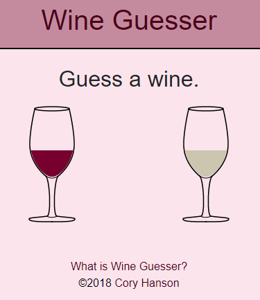

# WINE GUESSER
I wanted to create a tool to help aspiring sommeliers in their blind tasting efforts. While employing the deductive tasting method and going through wine tasting grid, input your observations into the wine guesser input forms. Wine Guesser will do its best to guess the wine varietal based on your observations.

## Details
This is a work in progress that will be replacing the following website.

[WineGuesser.Com](https://wineguesser.com)

## Author
[Cory Hanson](https://coryhanson.us)

## Built With
[Node](https://nodejs.org)

[React](https://reactjs.org)

[react-bootstrap](https://react-bootstrap.netlify.com/)

[Amazon Web Services](https://aws.amazon.com/) - S3, DynamoDB, Lambda, CodePipeline

## License
MIT